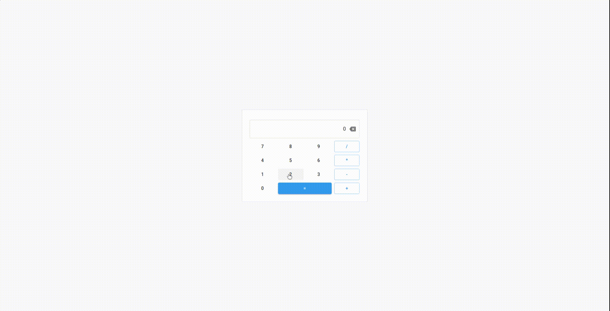

# Calculator App

A simple calculator App

## Acknowledgements

 - [React](https://reactjs.org/docs/getting-started.html)
 - [React MUI](https://material-ui.com/getting-started/installation/)
 - [Jest](https://jestjs.io/docs/getting-started)
  
## Screenshots


  
## Run Locally

Clone the project

```bash
  git clone https://github.com/sebastiaomfneto/spotify-client-pwa.git
```

Go to the project directory

```bash
  cd spotify-client-pwa
```

Install dependencies

```bash
  npm install
```

Start the server

```bash
  npm run start
```

  
## Running Tests

To run tests, run the following command

```bash
  npm run test
```

  
## License

[MIT](https://choosealicense.com/licenses/mit/)

  